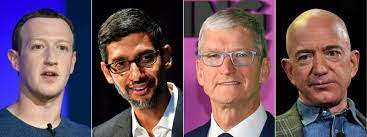

White and Asian men – the [dominant players](https://www.wired.com/story/five-years-tech-diversity-reports-little-progress/) in much of the tech industry – are made out to be the heroes of Silicon Valley.  They’re painted as [drop out tech prodigies](https://www.wbur.org/news/2017/05/25/zuckerberg-harvard-commencement) and [workaholic geniuses](https://qz.com/163262/even-as-a-child-jeff-bezos-was-a-data-obsessed-workaholic-genius/), bringing innovations to the table like the iPhone and Amazon’s A10 algorithm.  While tech wizards leave the public starstruck, data ethicists are pulling in the reins. 

  

[Timnit Gebru](https://twitter.com/timnitGebru?ref_src=twsrc%5Egoogle%7Ctwcamp%5Eserp%7Ctwgr%5Eauthor), [Margaret Mitchell](https://www.m-mitchell.com/) and [Joy Buolamwini](https://twitter.com/jovialjoy?lang=en), among others, question the morality of artificial intelligence for a living.  They call attention to the fact that [black faces go unrecognized by software](https://sitn.hms.harvard.edu/flash/2020/racial-discrimination-in-face-recognition-technology/).  They estimate the [environmental and financial impacts](https://www.technologyreview.com/2020/12/04/1013294/google-ai-ethics-research-paper-forced-out-timnit-gebru/) of large-scale computing.  They are hired to be vocal and frank about issues in the tech industry.  Yet when tech giants are publicly critiqued, they quickly become defensive and deny their employee’s claims.  [Gebru was fired](https://www.washingtonpost.com/technology/2020/12/23/google-timnit-gebru-ai-ethics/) from Google last December, as was [Mitchell last week](http://bbc.com/news/technology-56135817). 
 
Minorities working in tech are few and far between.  “For people in positions of power and privilege, issues of race and gender and class and ability—to name only a few—are OPP: other people’s problems” says the [authors of Data Feminism](https://data-feminism.mitpress.mit.edu/pub/vi8obxh7/release/3?readingCollection=0cd867ef).  Those who already have a platform in the tech industry put efforts to diversify the workforce on the back burner.  The tech industry is designed for white and Asian cisgender heterosexual men to succeed and kicks others to the curb.  

Though there is a broader range of diversity in the data ethics sphere.  The responsibility of understanding and acknowledging algorithmic bias falls on the shoulders of those most impacted.  People of color, women and LGBTQ+ folks strive to make data collection and analysis more intersectional.  Their efforts, however, are often seen as dampening entrepreneurial spirit and curtailing innovation.  

When minorities are included in conversations around data, their metrics are exploited.  Faulty facial recognition software was used to [arrest a black man](https://www.nytimes.com/2020/06/24/technology/facial-recognition-arrest.html) for a crime he didn’t commit.  People of color are [over-surveilled](https://privacyinternational.org/news-analysis/3926/ethnic-minorities-greater-risk-oversurveillance-after-protests) at protests.  Tweets written by African Americans are [1.5 times more likely](https://www.vox.com/recode/2019/8/15/20806384/social-media-hate-speech-bias-black-african-american-facebook-twitter) to be flagged as “offensive” than those written by their white counterparts.  This is as much of a national issue as it is an international one.  China uses image analysis to [detain and force Uighurs](https://www.nytimes.com/interactive/2019/11/16/world/asia/china-xinjiang-documents.html) to pursue nationalist agendas.  

Just as women and people of color have developed a [higher aversion](https://www.vox.com/recode/2019/8/15/20806384/social-media-hate-speech-bias-black-african-american-facebook-twitter) to vaccines than White men, minorities may become radically wary of where their data goes.  
