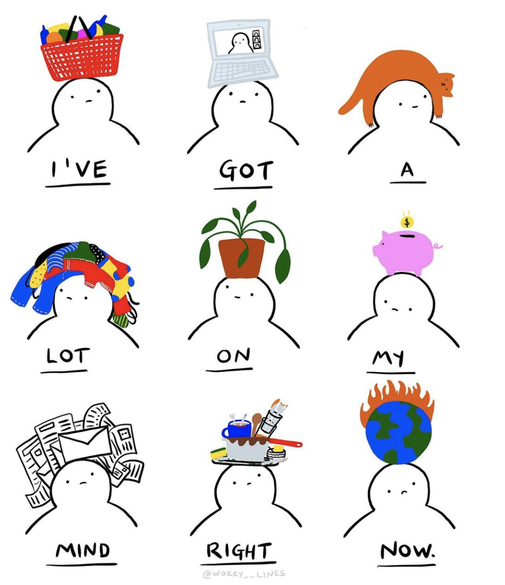

Each week I spend the better part of a morning reading and taking notes on a chapter of Data Feminism.  I detail my official notes in a notebook and scribble my thoughts on sticky notes.  While reading and writing, I pin down the subject of my blog for the week and begin to outline my thoughts in a word document.  I then sit down to write my blog post. Often, I get a sentence or two out before going back to my notebook and post-it strewn wall.  Sometimes I put down a few thoughts and digest the material for a day or two, thinking that the words will follow.  Soon it’s Thursday and I type a sentence then delete.  Then reword and delete.  Sunday rolls around and I know exactly what I want to say but my words and the page mix worse than oil and water.

Occasionally I can pull off exactly what I want to say by Sunday at midnight.  Though most of the time I think my ruminations on the social inequity don’t do the topic justice.  I’m afraid to voice my half-formed thoughts.  

  

  
This is dangerous.  Playing with ideas that don’t yet make sense is the only way to truly learn about them.  Instead, I pull away from engaging entirely because I’m petrified of covering racial injustice non- holistically (do I know any writers who cover all facets of racial discrimination?).
  
As a writing tutor, I help students like me overcome writing anxiety on a weekly basis.  What’s the deal with me?  Why can’t I help myself?  

I can’t help myself because I’m writing about myself.  I am a genderqueer homosexual of color trying to pursue data science.  Every time I think about job prospects I wonder if companies like Google [don’t want to employ me](https://themarkup.org/google-the-giant/2021/02/11/google-has-been-allowing-advertisers-to-exclude-nonbinary-people-from-seeing-job-ads) because I’m questioning my gender identity.  When I made a TikTok this week, I wondered if the algorithm would push me out of other users feed [because of my race](https://www.buzzfeednews.com/article/laurenstrapagiel/tiktok-algorithim-racial-bias).  I’m too close to the subject matter.  Writing about data as it relates to intersectional feminism feels personal more so than academic.

In [chapter 2 of Data Feminism](https://data-feminism.mitpress.mit.edu/pub/ei7cogfn/release/2?readingCollection=0cd867ef), the authors emphasize the importance of collecting data that represent the truest picture, analyzing data without prejudice, imagining a world where data doesn’t exacerbate injustice and teaching folks about ethical data practices.  These four steps put data scientists, and anyone even tangentially involved with analysis, on the track of co-liberating minoritized groups.  Though, jumping right into this intense process feels daunting.

D’Ignazio and Klein left out a critical step.  Breaks from thinking about racism, sexism, classism and other isms are essential.  This type of work is taxing.  It requires equal energy to ponder data ethics in a technical sense as it does an interpersonal one.  Collecting, analyzing, imagining and teaching cannot be done without breathing every once in a while.  
